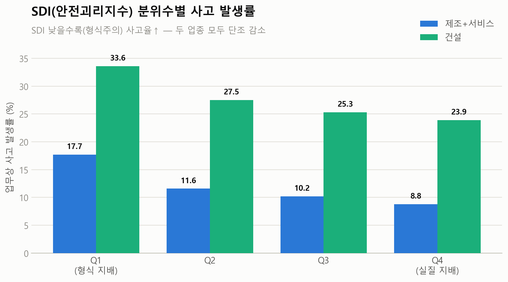
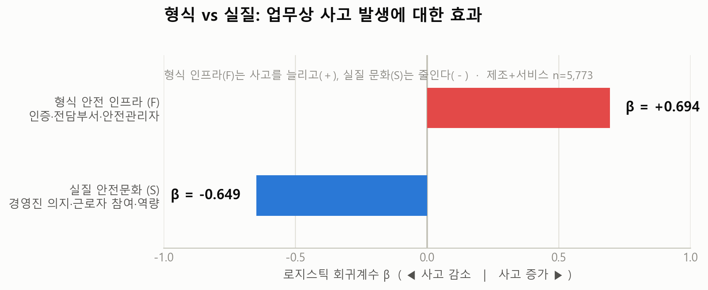

<h1 align="center">안전괴리지수(SDI)와 업무상 사고 발생의 연관성</h1>
<p align="center">
  <em>Safety Decoupling Index and Occupational Accident Risk<br>in Manufacturing and Service Workplaces</em>
</p>

<p align="center">
  
  
  
  
</p>

---

## 한 줄 요약

> **기업은 정부 규제·과징금을 피하려 "서류상 안전(형식)"에는 투자하지만, "실제로 사고를 줄이는 안전(실질)"은 방치한다.** 이 괴리를 `SDI = 실질(Substantive) − 형식(Formal)` 로 수치화하고, SDI가 실제 업무상 사고 발생을 예측하는지 검증한다.

`SDI < 0` → 형식만 있고 실질이 부족한 **안전 형식주의(safety decoupling)** · `SDI > 0` → 실질이 형식을 앞서는 **진짜 안전**

---

## 핵심 발견 ①  —  SDI가 낮을수록 사고가 많다

SDI 최저 분위(형식 지배) 사업장의 사고율은 최고 분위(실질 지배)의 **약 2배**. 두 업종 모두 단조 감소.

<p align="center">
  <picture>
    <source media="(prefers-color-scheme: dark)" srcset="assets/quartile_dark.png">
    
  </picture>
</p>

## 핵심 발견 ②  —  형식 인프라는 사고를 막지 못한다

형식/실질을 분리 투입하면 부호가 **정반대**로 갈린다. 형식 안전 인프라(인증·전담부서·안전관리자)가 많을수록 사고 확률이 오히려 **증가**(β=+0.694)하고, 실질 안전문화(경영진 의지·근로자 참여·역량)는 사고를 **감소**(β=−0.649)시킨다. 이 차이는 통계적으로 유의(Wald diff=−1.343, p=0.002).

<p align="center">
  <picture>
    <source media="(prefers-color-scheme: dark)" srcset="assets/coef_dark.png">
    
  </picture>
</p>

> **"서류상 안전이 실제 안전을 보장하지 않는다"** — 안전 형식주의의 핵심 명제를 데이터가 직접 지지한다.

---

## 주요 결과

| 모형 | 대상 | 결과 | 가설 판정 |
|---|---|---|---|
| A: 사고 ~ SDI | 제조+서비스 (n=5,773) | β=**−0.676**, OR=0.509, p=0.003 | ✅ 지지 |
| B: 사고 ~ 형식(F)+실질(S) | 제조+서비스 | β_F=**+0.694**, β_S=**−0.649**, diff=−1.343, p=0.002 | ✅ 지지 (최강) |
| A: 사고 ~ SDI | 건설 (n=1,480) | β=+0.346, p=0.229 | ✗ 불지지 |
| 업종 조절효과 | 전체 | SDI×건설더미 β=+1.145, p=0.001 | 업종 간 구조적 이질 확인 |

**강건성:** 경계변수 재분류(β=−0.532)·50인↑ 표본(β=−0.905, 효과 강화)·사고+질병 복합 DV(β=−0.534) 모두 방향 유지.
**측정 타당성:** Cronbach α=0.938, KMO=0.944, EFA 2요인 구조 확정(형식·실질), 판별타당도 r=0.007.

---

## 방법론

1. **데이터** — 제10차 산업안전보건 실태조사 (제조 3,255 · 서비스 2,551 · 건설 1,502 = **7,308 사업장**).
2. **변수 분류** — 코드북 문구 + 탐색적 요인분석(EFA, 주축분해·Varimax)으로 각 문항을 **형식(Formal)** / **실질(Substantive)** 로 분류. 핵심은 형식–실질 쌍: 규정을 *가지고 있다*(형식) ↔ 규정이 *실질적으로 도움된다*(실질).
3. **지수 구성** — 방향 정렬 → Min-Max 정규화 → 형식점수(F)·실질점수(S) 합성 → `SDI = S − F`.
4. **가설 검증** — 로지스틱 회귀로 `any_accident`(2021년 업무상 사고 발생 여부) 예측. F/S 분리 모형의 Wald 검정으로 β_S < β_F 확인.

> 세 업종은 설문 문항 번호·구성이 달라 변수명이 같아도 의미가 다르다. 통합 분석은 변수명 교집합이 아니라 **의미 기반 개념 매핑**으로만 정렬했다. (상세: [`CLAUDE.md`](CLAUDE.md))

---

## 저장소 구조

```
SAB_paper/
├── 안전괴리지수와 업무상 사고 발생의 연관성 논문.pdf   # 최종 논문
├── CLAUDE.md          # 분석 워크플로우 지침 (변수 매핑·결측처리·EFA 설계)
├── DESIGN.md          # 연구 설계
├── known_issues.md    # 연구의 본질적 한계 (횡단설계·자기보고 편향 등)
├── version1~6/        # 분석 반복 이력 (V6 최종)
│   └── version6/      # ★ 최종: DESIGN_v6.md · run_v6.py · output/
├── assets/            # README 시각자료
└── data/raw/          # 원본 설문 microdata (※ 재배포 라이선스 문제로 미포함)
```

**버전 이력:** V1~V2(DV=사고 건수, 폐기) → V3~V5(DV=위험성평가 빈도, 개념 불일치) → **V6**(DV=실제 사고 발생 이진, 확정).

---

## 재현

```bash
pip install pandas numpy factor_analyzer "scikit-learn<1.6" statsmodels matplotlib
python version6/run_v6.py
```

> `data/raw/`의 원본 설문 데이터가 필요하다. 제10차 산업안전보건 실태조사 원자료는 **안전보건공단(KOSHA)** 을 통해 취득한다 — 재배포 제한으로 본 저장소에는 포함하지 않았다.

---

## 연구의 한계

횡단면 자료로 인과가 아닌 **연관성**만 확인 가능(역인과 배제 불가) · 실질 변수의 자기보고 편향 · 사고 건수 과소보고 가능성 · 형식/실질 경계의 이론적 모호성. 상세는 [`known_issues.md`](known_issues.md).

---

<p align="center"><sub>산업안전보건 논문 경진대회 출품작 · 분석 파이프라인 및 재현 코드</sub></p>
